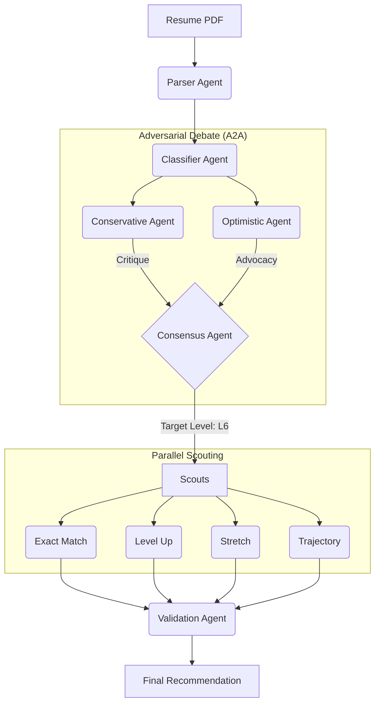

# Agentic Job Search Recommender (Arbiter) 
**Google AI Agents Intensive Capstone Project (Concierge Track)**

> **"Your resume argues with itself."**
> AI agents debate your level, reach consensus, then find jobs you'd actually take.

## The Problem: Title Inflation vs. Reality
Job boards treat your resume as a bag of keywords. They match "Python" to "Python" and call it a day. But in the real world, a "Head of Product" at a 50-person startup might map to a "Senior PM" at a Big Tech firm. The problem isn't search—it's **calibration**.

## The Solution: Adversarial Consensus
This is not a standard RAG wrapper. It is a **multi-agent system** that creates artificial tension through deliberation. It uses an **Agent-to-Agent (A2A)** protocol to simulate a hiring committee:

1.  **The Skeptic (Conservative):** Anchors low, finding gaps in tenure and scope.
2.  **The Optimist (Recruiter):** Anchors high, emphasizing potential and transferable skills.
3.  **The Mediator (Consensus):** Synthesizes the debate into a calibrated level (e.g., L5 vs L6).

Only *after* the level is calibrated do the **Scout Agents** deploy to find roles.



## 4-Tier Recommendation Output
Instead of a flat list, jobs are categorized by career strategy:

| Tier | Strategy | What It Means |
| :--- | :--- | :--- |
| **Exact Match** | High Confidence | You could land this next week. |
| **Level Up** | Growth | Your next promotion, externally. |
| **Stretch** | High Risk/Reward | Ambitious but theoretically possible. |
| **Trajectory** | North Star | Where your career wants to go in 3-5 years. |

## Tech Stack & Architecture

**Backend:**
*   **Framework:** Python 3.10+, FastAPI + Uvicorn
*   **Orchestration:** **Google ADK (Agent Development Kit)**
*   **Models:** Gemini 2.5 Flash (Scouts), Pro (Reasoning), Flash-Lite (Parsing)
*   **Tools:** Google Search Grounding, PyPDF2, custom career calculators

**Frontend:**
*   React 18 + TypeScript + Vite
*   Tailwind CSS
*   Server-Sent Events (SSE) for real-time debate streaming

## Google ADK Implementation Details
This project pushes the ADK beyond simple function calling. It demonstrates:

*   **A2A Protocol:** Agents communicating directly with other agents to resolve conflict.
*   **Session State:** Maintaining the "debate" context across multiple turns.
*   **Custom Tools:** Specialized logic for Year-of-Experience (YoE) calculation.
*   **Parallel Execution:** Scout agents run concurrently to reduce latency.
*   **Human-in-the-Loop:** User feedback refines the consensus model.

*(Requirement was 3 concepts; this implementation demonstrates 7.)*

## Quick Start

### Prerequisites
*   Python 3.10+
*   Node.js 18+
*   Google API Key (via AI Studio)

### Backend Setup
```bash
cd app/backend

# Create virtual environment
python -m venv venv
source venv/bin/activate  # Windows: venv\Scripts\activate

# Install dependencies
pip install -r requirements.txt

# Set environment variables
cp .env.example .env
# Edit .env and add your GOOGLE_API_KEY

# Run the server
python main.py
```
*Backend runs at http://localhost:8000*

### Frontend Setup
```bash
cd app/frontend

# Install dependencies
npm install

# Run development server
npm run dev
```
*Frontend runs at http://localhost:5173*

## API Endpoints

| Method | Endpoint | Description |
| :--- | :--- | :--- |
| `POST` | `/api/v1/analyze/stream` | **Core Loop.** Streams the debate and analysis via SSE. |
| `POST` | `/api/v1/refine/stream` | Refines results based on user feedback. |
| `GET` | `/api/v1/health` | System health check. |

## Security & Privacy
*   **Ephemeral Processing:** Resumes are processed in memory and never stored on disk.
*   **Input Limits:** File uploads capped at 10MB; Context windows managed via token limits.

## Context
Built for the **Kaggle Agents Intensive** (November 2025).
*   **Track:** Concierge Agents
*   **Status:** Capstone Project

## Author
**Yves Agbre**
[LinkedIn](https://www.linkedin.com/in/yvesagbre/) · [GitHub](https://github.com/yagbre21)

## 📄 License
**CC-BY-SA 4.0**
*Open source for educational analysis. Commercial derivatives must credit the original architecture.*
