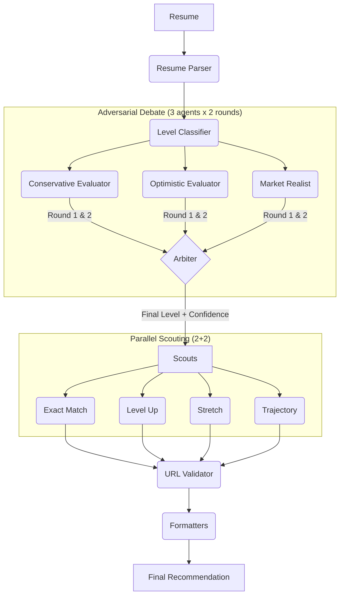

# Agentic Job Search Recommender (Arbiter)
**Google AI Agents Intensive Capstone Project (Concierge Track)**

> This capstone project evolved into **[Arbiter](https://arbiter.convorecs.ai)**, a production 11-agent career assessment system by [ConvoRecs LLC](https://convorecs.ai).

> **"100 jobs shouldn't need 100 rewrites!"**
> AI agents debate your level, reach consensus, then find jobs that fit you. Not the other way around.

## The Problem: Title Inflation vs. Reality
Job boards treat your resume as a bag of keywords. They match "Python" to "Python" and call it a day. But in the real world, a "Head of Product" at a 50-person startup might map to a "Senior PM" at a Big Tech firm. The problem isn't search - it's **calibration**.

Most job seekers apply to 100+ positions with the same resume. Arbiter argues this is backwards - it determines your *actual* market level first (through adversarial debate), then finds jobs calibrated to that level.

## The Solution: Adversarial Consensus
This is not a standard RAG wrapper. It is a **multi-agent system** that creates artificial tension through deliberation. It uses an **Agent-to-Agent (A2A)** protocol to simulate a hiring committee:

1.  **The Conservative** - Skeptical hiring manager. Anchors low, finding gaps in tenure and scope.
2.  **The Optimistic** - Talent scout. Anchors high, emphasizing potential and transferable skills.
3.  **The Market Realist** - Labor market analyst. Grounds the debate in hiring demand, compensation benchmarks, and industry trends.

Only *after* the level is calibrated do the **Scout Agents** deploy to find roles.

```mermaid
graph TD
    User[Resume] --> Parser(Resume Parser)
    Parser --> Classifier(Level Classifier)

    subgraph "Adversarial Debate (3 agents x 2 rounds)"
        Classifier --> Conservative(Conservative Evaluator)
        Classifier --> Optimistic(Optimistic Evaluator)
        Classifier --> Realist(Market Realist)
        Conservative -- "Round 1 & 2" --> Arbiter{Arbiter}
        Optimistic -- "Round 1 & 2" --> Arbiter
        Realist -- "Round 1 & 2" --> Arbiter
    end

    Arbiter -- "Final Level + Confidence" --> Scouts

    subgraph "Parallel Scouting (2+2)"
        Scouts --> Exact(Exact Match)
        Scouts --> LevelUp(Level Up)
        Scouts --> Stretch(Stretch)
        Scouts --> Trajectory(Trajectory)
    end

    Exact --> Validator(URL Validator)
    LevelUp --> Validator
    Stretch --> Validator
    Trajectory --> Validator

    Validator --> Formatter(Formatters)
    Formatter --> Output[Final Recommendation]
```

## 4-Tier Recommendation Output
Instead of a flat list, jobs are categorized by career strategy:

| Tier | Strategy | What It Means |
| :--- | :--- | :--- |
| **Exact Match** | High Confidence | You could land this next week. |
| **Level Up** | Growth | Your next promotion, externally. |
| **Stretch** | High Risk/Reward | Ambitious but theoretically possible. |
| **Trajectory** | North Star | Where your career wants to go in 3-5 years. |

## The 11-Agent Pipeline

Each agent has a distinct role. The pipeline is sequential, with parallel execution within stages:

| # | Agent | Role | Model Tier |
| :--- | :--- | :--- | :--- |
| 1 | Resume Parser | Extract roles, skills, YOE (with date overlap dedup) | Fast |
| 2 | Level Classifier | Map to career level scale, validate against market data | Standard |
| 3-5 | Debate Committee | Conservative, Optimistic, Market Realist (2 rounds) | Deep |
| 6 | Arbiter | Weighted final decision from all 6 arguments | Deep |
| 7-10 | Job Scouts | 4 parallel scouts search for real postings per tier | Fast |
| 11 | URL Validator | Verify links are live, self-heal broken URLs | Fast |
| - | Formatters | Profile + Job Cards (split for reliability) | Standard |

**The debate is genuine, not scripted.** In Round 2, each agent reads the others' Round 1 arguments and responds directly - conceding where warranted, pushing back where they disagree. Each run produces different arguments based on the specific resume. The Arbiter reads all 6 arguments and renders a weighted vote (50% own assessment, 50% committee).

## Tech Stack

| Layer | Technology |
| :--- | :--- |
| Orchestration | **Google ADK (Agent Development Kit)** |
| Models | Gemini 2.5 Flash (Scouts), Pro (Reasoning), Flash-Lite (Parsing) |
| Backend | Python 3.10+, FastAPI, SSE streaming |
| Frontend | React 18, TypeScript, Vite, Tailwind CSS |
| Search | Google Search Grounding (real-time job postings) |

## Google ADK Implementation

This project pushes the ADK beyond simple function calling:

*   **A2A Protocol:** Agents communicating directly with other agents to resolve conflict.
*   **Session State:** Maintaining the "debate" context across multiple turns.
*   **Custom Tools:** Year-of-Experience calculation with overlap deduplication, URL validation with search fallback.
*   **Parallel Execution:** Scout agents run concurrently (2+2 batched to manage rate limits).
*   **Human-in-the-Loop:** User feedback triggers a separate refinement agent tree.
*   **Model Tiering:** Different Gemini models per agent role (lite for parsing, pro for reasoning).
*   **Real-time Streaming:** Full pipeline progress streamed via SSE as each agent completes.

*(Google's requirement was 3 ADK concepts; this implementation demonstrates 7.)*

## From Capstone to Production

This repository contains the original capstone submission (November 2025). I shipped it as a production product at [arbiter.convorecs.ai](https://arbiter.convorecs.ai) - publicly available, no sign-in required.

| | Capstone | Production |
| :--- | :--- | :--- |
| Agents | 7 | 11 |
| Debate | 2 agents, 1 round | 3 agents, 2 rounds with cross-agent rebuttals |
| Input | PDF only | PDF, DOCX, TXT, paste |
| Job search | Sequential | Batched parallel with rate limit management |
| Link quality | No validation | Self-healing URL validator with search fallback |
| Output | Single formatter | Split formatters (profile + job cards) for reliability |

Built solo using Claude Code as part of ConvoRecs LLC (29K+ lines of production AI code across products).

## Context
Built for the **Google AI Agents Intensive** via Kaggle (November 2025).
*   **Track:** Concierge Agents
*   **Training:** Google ADK curriculum with Adnan Masood, PhD as lecturer

## Author
**Yves Agbre** - Founder, ConvoRecs LLC
[LinkedIn](https://www.linkedin.com/in/yagbre) · [GitHub](https://github.com/yagbre21) · [arbiter.convorecs.ai](https://arbiter.convorecs.ai)

## License
**CC-BY-SA 4.0**
*Open source for educational analysis. Commercial derivatives must credit the original architecture.*
